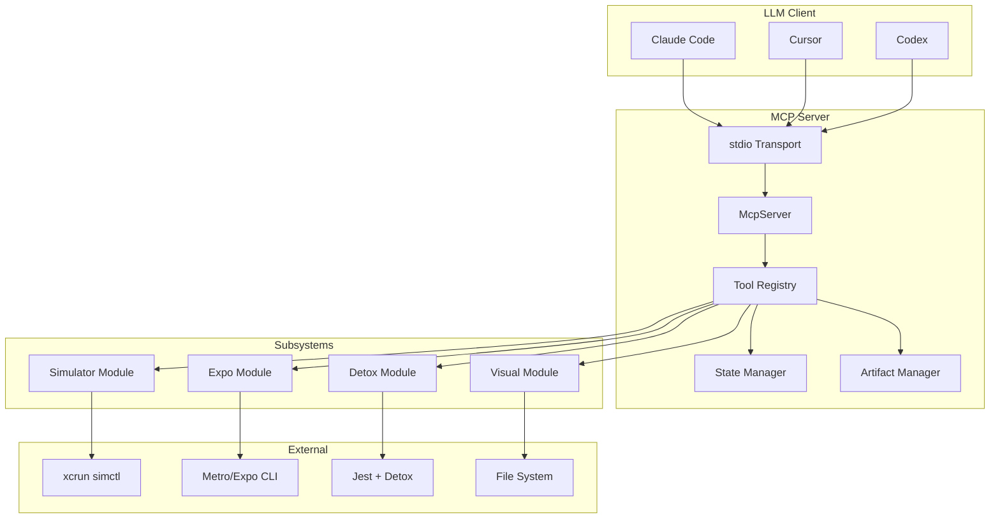
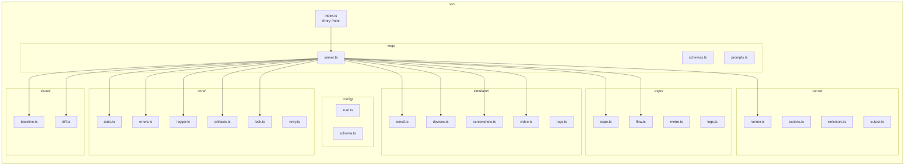
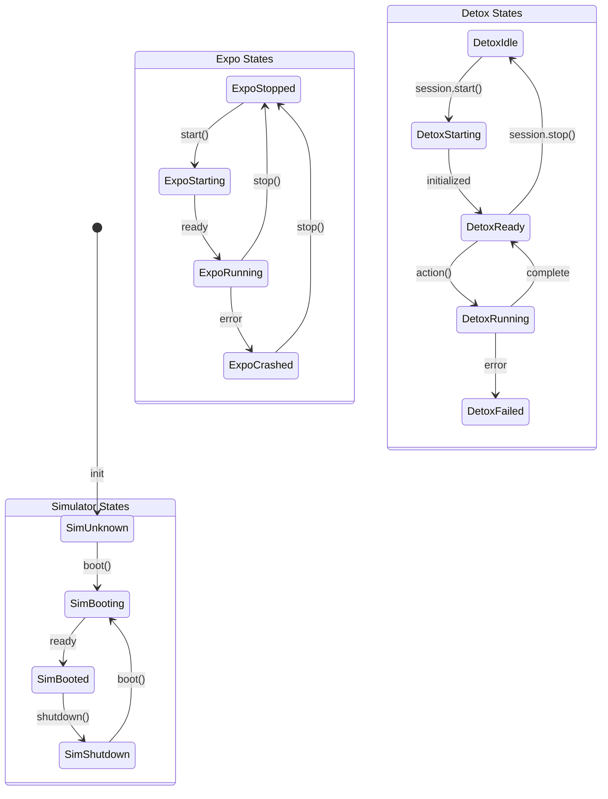
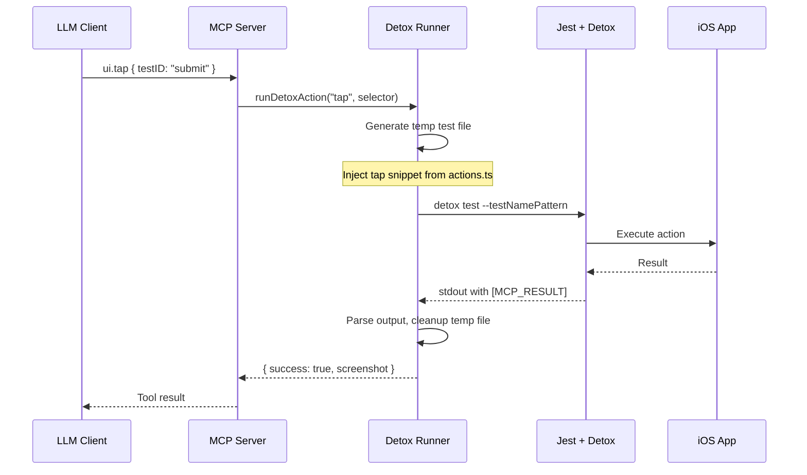
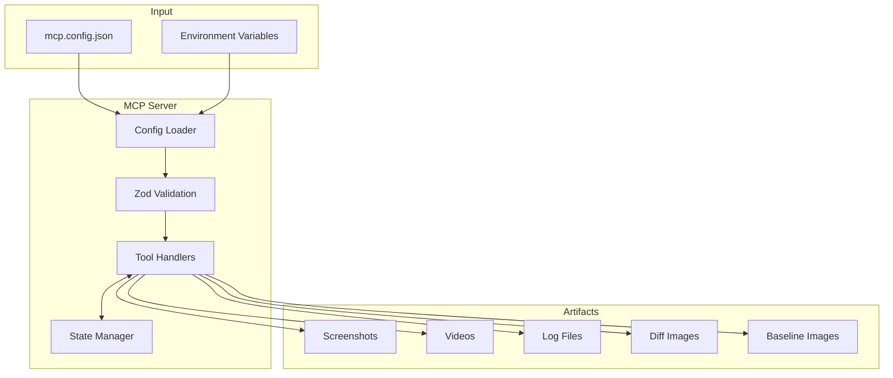

# Architecture Documentation

> Expo iOS Development MCP Server - Technical Architecture

## Overview

This MCP (Model Context Protocol) server enables LLM tools (Claude Code, Cursor, Codex) to control iOS Simulator, Expo/Metro development server, and Detox for UI automation. It uses **stdio transport** for JSON-RPC communication.

### Key Statistics

| Metric | Value |
|--------|-------|
| Total Files | 27 |
| Total Lines | 4,768 |
| Average Complexity | 12.9 |
| Code Consistency | 99% |
| Circular Dependencies | 0 |

## High-Level Architecture



## Module Architecture



## Core Subsystems

### 1. State Machine (`src/core/state.ts`)

Central singleton tracking the state of all managed components. All tools check state prerequisites before execution.



**State Types:**
- `SimulatorState`: `unknown` | `booting` | `booted` | `shutdown`
- `ExpoState`: `stopped` | `starting` | `running` | `crashed`
- `DetoxState`: `idle` | `starting` | `ready` | `running` | `failed`

**Prerequisites for UI Commands:**
```typescript
canRunUiCommands(): boolean {
  return this.isSimulatorReady() && this.isDetoxReady();
}
```

### 2. Error Taxonomy (`src/core/errors.ts`)

LLM-friendly error system with structured codes, remediation hints, and evidence paths.

| Error Code | Category | Remediation |
|------------|----------|-------------|
| `SIM_NOT_BOOTED` | Simulator | Boot the simulator first |
| `SIM_NOT_FOUND` | Simulator | Check available simulators |
| `SIMCTL_TIMEOUT` | Simulator | Retry operation |
| `EXPO_NOT_RUNNING` | Expo | Start Expo first |
| `EXPO_CRASHED` | Expo | Check logs, restart |
| `DETOX_NOT_READY` | Detox | Initialize session |
| `ELEMENT_NOT_FOUND` | UI | Verify testID/selector |
| `VISUAL_DIFF_TOO_HIGH` | Visual | Review diff image |

**Error Structure:**
```typescript
interface McpError {
  code: ErrorCode;
  message: string;
  details?: string;
  remediation?: string;
  evidence?: string[];  // paths to screenshots, logs
}
```

### 3. Logger (`src/core/logger.ts`)

Ring buffer-based logger with per-source retention. Never writes to stdout (reserved for JSON-RPC).

**Sources:** `mcp` | `simulator` | `expo` | `detox` | `visual` | `lock` | `retry`

**Buffer Size:** 20,000 entries per source

```typescript
logger.info("expo", "Metro server ready", { url: metroUrl });
logger.error("detox", "Element not found", { selector });
```

### 4. Concurrency Lock (`src/core/lock.ts`)

Prevents simultaneous operations on shared resources.

```typescript
await withLock("simulator:boot", "Boot iPhone 15", async () => {
  return await bootDevice(deviceName);
});
```

### 5. Retry with Backoff (`src/core/retry.ts`)

Exponential backoff for transient failures.

```typescript
await withRetry("simctl boot", async () => {
  return await bootDevice(deviceName);
}, {
  maxAttempts: 3,
  initialDelayMs: 1000,
  backoffMultiplier: 2,
  jitter: true
});
```

**Retryable Codes:** `SIMCTL_TIMEOUT`, `TIMEOUT`, `DETOX_TEST_FAILED`

## Detox Micro-Test Pattern

Detox is a test framework, not an interactive driver. UI automation works by generating and executing temporary Jest tests.



**Key Files:**
- `src/detox/runner.ts` - Test execution orchestration
- `src/detox/actions.ts` - Code snippet generators (tap, type, swipe, etc.)
- `src/detox/selectors.ts` - Selector to Detox expression conversion
- `src/detox/output.ts` - Parse `[MCP_RESULT]...[/MCP_RESULT]` markers

## Tool Registry

### Simulator Tools

| Tool | Description | Complexity |
|------|-------------|------------|
| `simulator.list_devices` | List available iOS simulators | Low |
| `simulator.boot` | Boot a simulator (with lock) | Medium |
| `simulator.shutdown` | Shut down a simulator | Low |
| `simulator.erase` | Factory reset a simulator | Low |
| `simulator.screenshot` | Take a screenshot | Low |
| `simulator.record_video.start` | Start video recording | Medium |
| `simulator.record_video.stop` | Stop video recording | Medium |
| `simulator.log_stream.start` | Start log streaming | Medium |
| `simulator.log_stream.stop` | Stop log streaming | Low |

### Expo Tools

| Tool | Description | Complexity |
|------|-------------|------------|
| `expo.start` | Start Expo/Metro server | High |
| `expo.stop` | Stop Expo/Metro server | Low |
| `expo.status` | Get Expo/Metro status | Low |
| `expo.logs.tail` | Get recent Expo logs | Low |
| `expo.reload` | Reload the app | Medium |

### UI Automation Tools (Detox)

| Tool | Description | Complexity |
|------|-------------|------------|
| `ui.tap` | Tap an element | Medium |
| `ui.long_press` | Long press an element | Medium |
| `ui.type` | Type text into an input | Medium |
| `ui.swipe` | Swipe gesture | Medium |
| `ui.scroll` | Scroll in a direction | Medium |
| `ui.press_key` | Press a keyboard key | Medium |
| `ui.wait_for` | Wait for element visibility | Medium |
| `ui.assert_text` | Assert element text content | Medium |
| `ui.assert_visible` | Assert element is visible | Medium |

### Visual Regression Tools

| Tool | Description | Complexity |
|------|-------------|------------|
| `visual.baseline.save` | Save baseline screenshot | Medium |
| `visual.baseline.list` | List saved baselines | Low |
| `visual.baseline.delete` | Delete a baseline | Low |
| `visual.compare` | Compare against baseline | High |

### Flow Tool

| Tool | Description | Complexity |
|------|-------------|------------|
| `flow.run` | Execute a sequence of tool calls | High |

## Data Flow



## Configuration Schema

```typescript
interface McpConfig {
  projectPath: string;           // Path to Expo/React Native project
  artifactsRoot?: string;        // Artifact storage (default: ./artifacts)
  defaultDeviceName?: string;    // Default simulator device
  detox?: {
    configuration?: string;      // Detox config name
    timeout?: number;            // Action timeout (ms)
  };
  expo?: {
    command?: string;            // Expo CLI command
    startArgs?: string[];        // Additional start args
  };
  visual?: {
    baselineDir?: string;        // Baseline storage
    defaultThreshold?: number;   // Default diff threshold
  };
  logs?: {
    bufferSize?: number;         // Log buffer size
    retentionDays?: number;      // Log retention period
  };
}
```

## MCP Resources

| Resource URI | Description |
|--------------|-------------|
| `resource://state` | Current server state (simulator, expo, detox) |
| `resource://logs/simulator/latest` | Recent simulator logs |
| `resource://logs/expo/latest` | Recent Expo logs |
| `resource://logs/detox/latest` | Recent Detox logs |
| `resource://artifacts/latest` | Artifact manifest |

## MCP Prompts

Pre-built prompt templates for common workflows:

| Prompt | Use Case |
|--------|----------|
| `repro_and_collect_evidence` | Bug reproduction with evidence collection |
| `ui_regression_check` | Visual regression testing |
| `test_user_flow` | End-to-end user flow testing |
| `debug_app_crash` | Crash investigation and recovery |
| `setup_test_session` | Fresh test session initialization |

## File Complexity Analysis

Top files by cyclomatic complexity:

| File | Lines | Complexity | Exports |
|------|-------|------------|---------|
| `src/mcp/server.ts` | 1,030 | 43 | 1 |
| `src/expo/expo.ts` | 267 | 29 | 6 |
| `src/visual/diff.ts` | 265 | 28 | 3 |
| `src/detox/runner.ts` | 320 | 25 | 4 |
| `src/visual/baseline.ts` | 209 | 23 | 7 |
| `src/simulator/devices.ts` | 196 | 22 | 6 |

## Conventions

### Import Style
- ESM modules with `.js` extension (NodeNext resolution)
- Relative imports for internal modules
- Double quotes for strings (99% consistency)

### Error Handling
- All async functions use try-catch
- Errors created via `createError()` with auto-remediation
- 56 try-catch blocks across the codebase

### Code Organization
- One class/module per file
- Singleton exports for managers (state, logger, artifacts, lock)
- Zod schemas for all tool inputs

## Dependencies

### Production
- `@modelcontextprotocol/sdk` - MCP protocol implementation
- `zod` - Schema validation
- `execa` - Process execution
- `pixelmatch` - Image comparison
- `pngjs` - PNG processing
- `ejs` - Template rendering

### Development
- `typescript` - Type system
- `tsx` - TypeScript execution
- `@types/*` - Type definitions

## Build & Run

```bash
pnpm build          # Compile TypeScript to dist/
pnpm dev            # Run in development mode with tsx
pnpm start          # Run production build
pnpm verify         # Verify environment (Xcode, simctl)
```

## Future Considerations

1. **Test Coverage**: No test files currently exist; consider adding Jest tests
2. **Type Safety**: Some modules could benefit from stricter type guards
3. **Caching**: Metro detection could use more aggressive caching
4. **Parallel Operations**: Lock manager could support read/write locks for better concurrency
